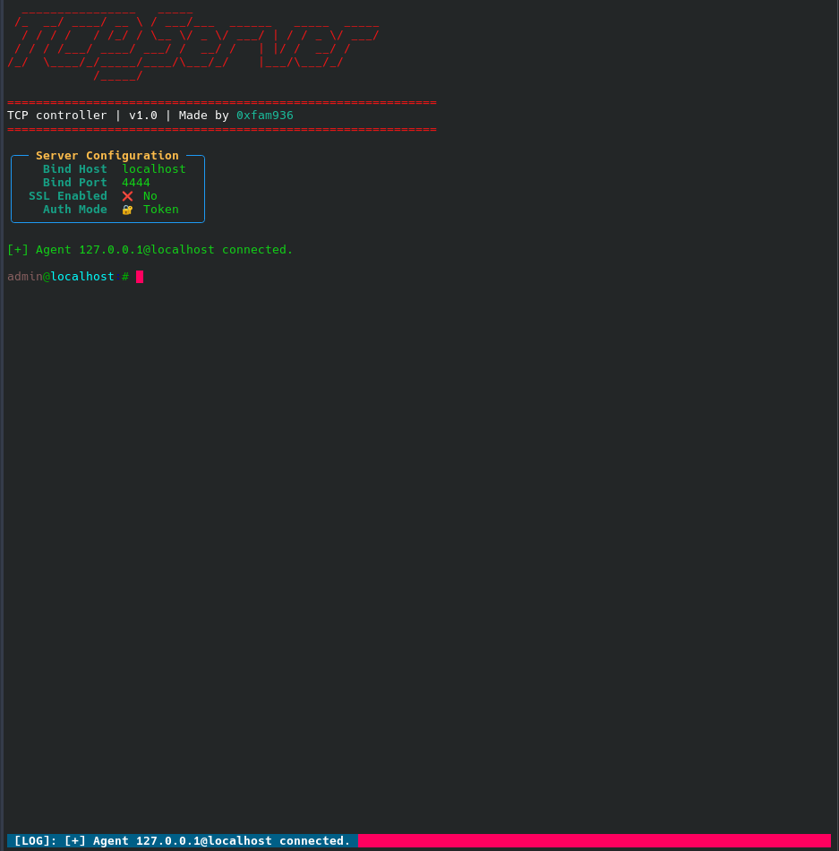
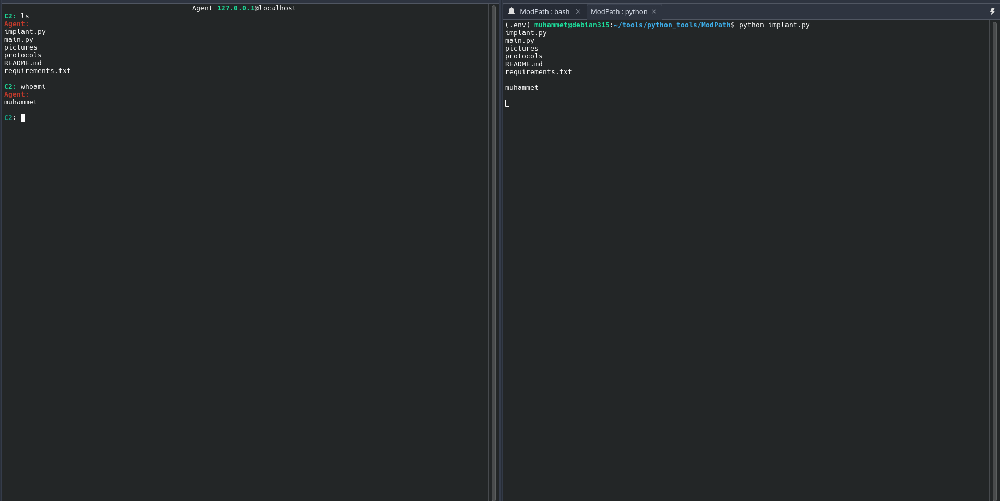

# ModPath

ModPath is an open source Linux C2 server.
The server implements raw TCP sockets.

### Feautures
- TLS over TCP
- Token based implant authentication
- Lightweight Python server
- Designed for Linux environments
- Implant interaction history 
### Architecture


#### Running server

#### Implant server interaction


---
### Getting Started
#### Requirements
- Python 3.10+
- Linux


#### Installation
```
pip install -r requirements.txt

```
#### Run the server
```
python main.py

```
#### See commands
```
list commands
```
---
### License

MIT License


