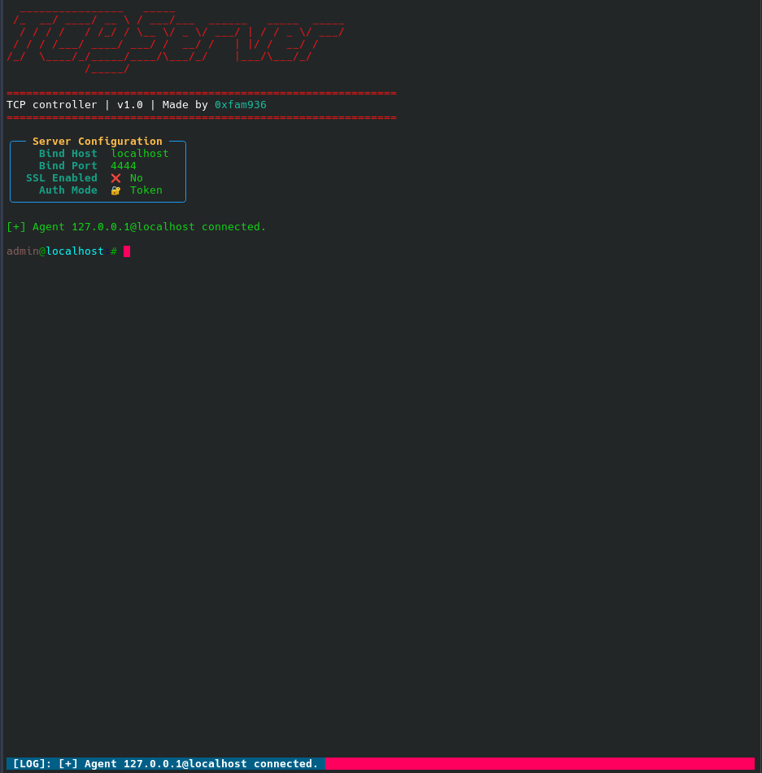
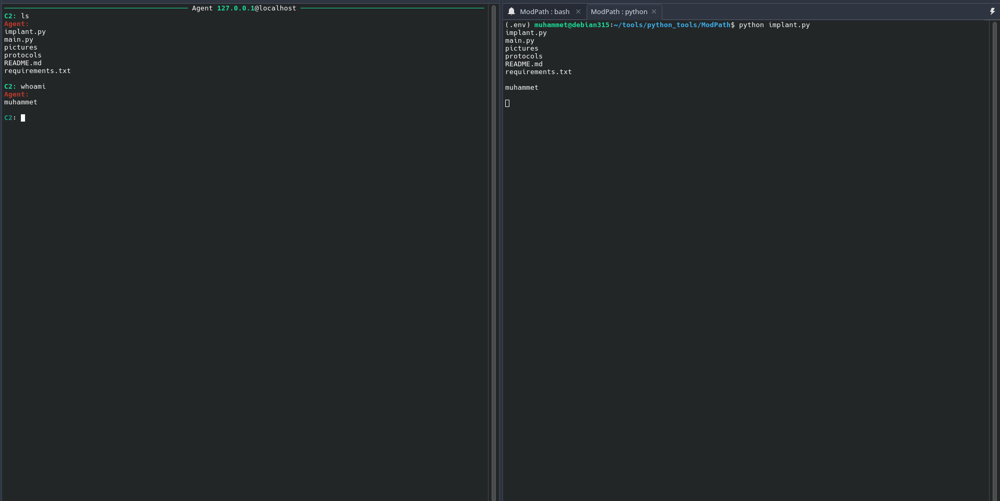

# ModPath 🕷️

**ModPath** is a lightweight, open-source Command and Control (C2) server designed specifically for Linux environments. Built from the ground up in Python, it leverages raw TCP sockets and asynchronous I/O to handle concurrent implant connections efficiently. 

* **Author:** Muhammet (0xfam936)
* **Status:** Actively maintained. 
* **Note:** I am a 3rd-year Cybersecurity student at Howest, currently looking for a **Penetration Testing / Red Teaming internship**. If you are looking for a passionate offensive security intern, feel free to reach out!

---

## 🚀 Key Features

ModPath was built with operational security (OPSEC) and usability in mind. 

* **Secure Communications (TLS):** Supports TLS over TCP to encrypt traffic between the server and implants, preventing network-level eavesdropping.
* **Token-Based Authentication:** Implants must authenticate using a secure token if a token is created else everyone can connect to the server, protecting the C2 from active scanners, rogue connections, and blue team probing.
* **Asynchronous Core:** Utilizes Python's `asyncio` for concurrent client handling, allowing the server to manage multiple implants seamlessly.
* **Modern TUI (Text User Interface):** Built using a combination of `Textual`, `Rich`, and `Curses` to provide a clean, responsive, and aesthetically pleasing operator console.
* **Session & Task Management:** Maintains a detailed history of implant interactions and asynchronous task tracking.

---

## 📸 Architecture & Previews

The C2 framework is split into a robust asynchronous backend and a sleek, interactive frontend for the operator.

### Server Interface & Options


### Implant Interaction & Tasking


---

## 🛠️ Getting Started

### Prerequisites
* **OS:** Linux
* **Python:** 3.10+

### Installation

1. Clone the repository:
   ```bash
   git clone [git@github.com:0xfam936/ModPath.git](https://github.com/0xfam936/ModPath)
   cd ModPath

```

2. Set up a virtual environment (Recommended):
```bash
python -m venv venv
source venv/bin/activate

```


3. Install the required dependencies:
```bash
pip install -r requirements.txt

```


### Usage

Launch the main operator interface:

```bash
python main.py

```

Once inside the ModPath console, you can explore the native C2 commands:

```bash
# List all native commands
list commands

# Generate a new authentication token for an implant
create token

# Set up your listener (e.g., host, port, TLS certs)
set host 0.0.0.0
set port 443

# Start the listener
start

```

---

## 📂 Project Structure

```text
.
├── implant.py                  # Client-side agent (Implant)
├── main.py                     # Entry point & TUI initialization
├── pictures/                   # Documentation assets
├── protocols/
│   ├── tcp/
│   │   ├── tcp_server.py             # Core Asyncio TCP server logic
│   │   └── tcp_server_controller.py  # Ties the TUI with the async server
│   └── utils/
│       ├── agent_menu.py       # Curses-based implant selector
│       ├── banner.py           # Figlet & styling
│       ├── prompt_style.py     # Operator prompt customization
│       └── utils.py            # Helper functions
├── README.md
└── requirements.txt

```

---

## ⚠️ Disclaimer

ModPath is developed for **educational and authorized testing purposes only**. It is designed to be used strictly for learning purposes. The author is not responsible for any misuse of this software.

---

## 📄 License

This project is licensed under the **MIT License**.

